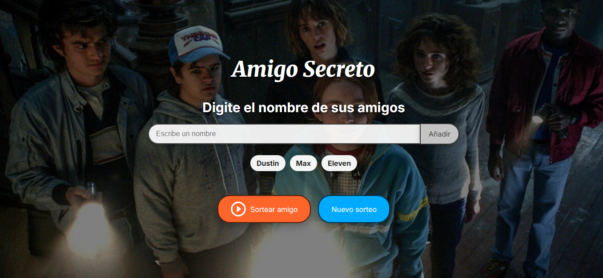
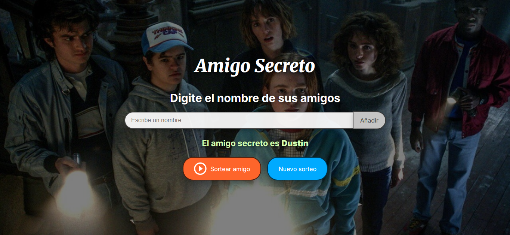

# 🎁 Challenge Amigo Secreto

Aplicación web interactiva para realizar un sorteo de "Amigo Secreto", permitiendo agregar nombres, visualizarlos en una lista y seleccionar aleatoriamente a un participante.

## 📋 Características

- **Agregar participantes**: Permite ingresar nombres a través de un campo de texto.
- **Validación de entradas**: Evita agregar nombres vacíos o con solo espacios.
- **Visualización dinámica**: Muestra en pantalla la lista de amigos añadidos.
- **Sorteo aleatorio**: Selecciona un amigo secreto al azar.
- **Controles dinámicos**:
  - Deshabilita opciones tras realizar el sorteo.
  - Permite reiniciar el juego para realizar un nuevo sorteo.
- **Diseño responsivo**: Adaptado a diferentes tamaños de pantalla.
- **Estética temática**: Fondo personalizado y tipografías modernas.

## 🖥️ Tecnologías utilizadas

- **HTML5**: Estructura de la aplicación.
- **CSS3**: Estilos personalizados con variables y diseño responsive.
- **JavaScript**: Lógica para agregar, mostrar y sortear amigos.
- **Google Fonts**: Tipografías *Inter* y *Merriweather*.
- **Imágenes y assets**: Iconos y fondo decorativo.

## 📂 Estructura del proyecto

```
    ├── assets/ # Imágenes y recursos (iconos, fondos, etc.)
    ├── img-pruebas # Imágenes de muestra
    ├── app.js # Lógica de la aplicación
    ├── index.html # Estructura principal
    ├── README.md # Descripción del proyecto
    └── style.css # Estilos y diseño
```

## 🚀 Uso

1. **Abrir el archivo** `index.html` en un navegador.
2. **Ingresar nombres** en el campo de texto y presionar el botón "Añadir".
3. Repetir el paso 2 hasta que todos los participantes estén en la lista.
4. Presionar el botón **"Sortear amigo"** para seleccionar uno al azar.
5. Usar el botón **"Nuevo sorteo"** para reiniciar el juego y empezar de nuevo.

## 📌 Validaciones y consideraciones

- No se puede sortear con menos de **dos nombres**.
- Los nombres vacíos o con espacios no son permitidos.
- Tras el sorteo, la lista y controles quedan bloqueados hasta iniciar un nuevo sorteo.

## 🎨 Imagenes de prueba
> 
> 
> 

## 👨‍💻 Autor
Desarrollado por **Kenny Miguel Rodríguez Madrid** como ejercicio de práctica en JavaScript.